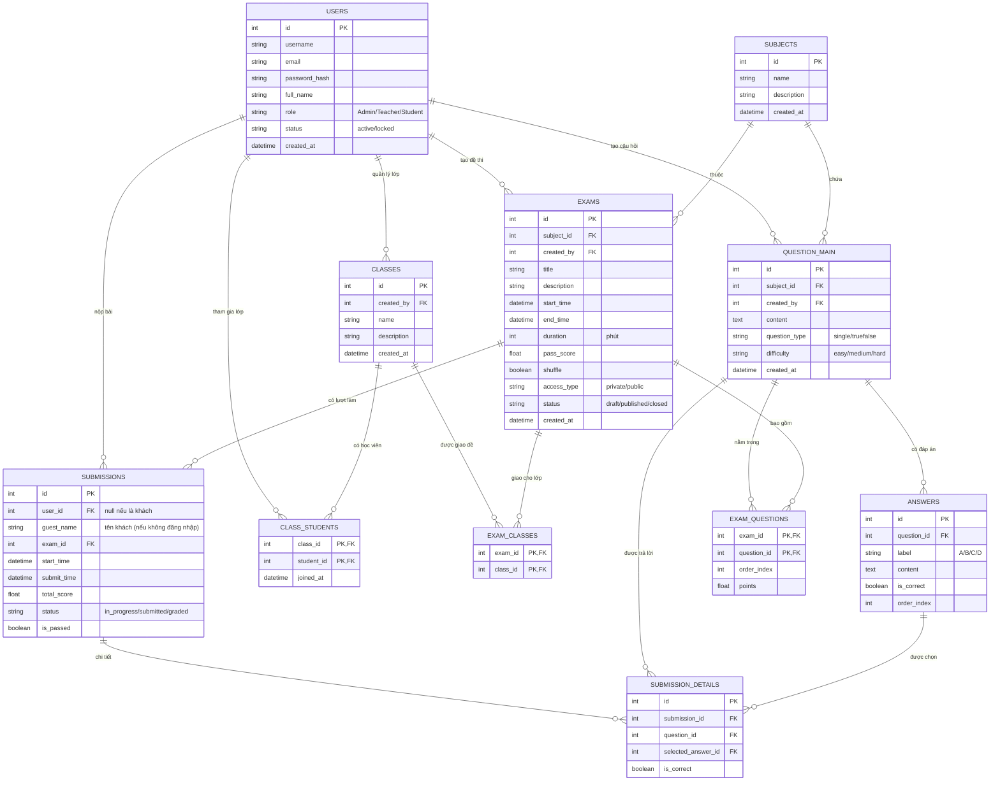
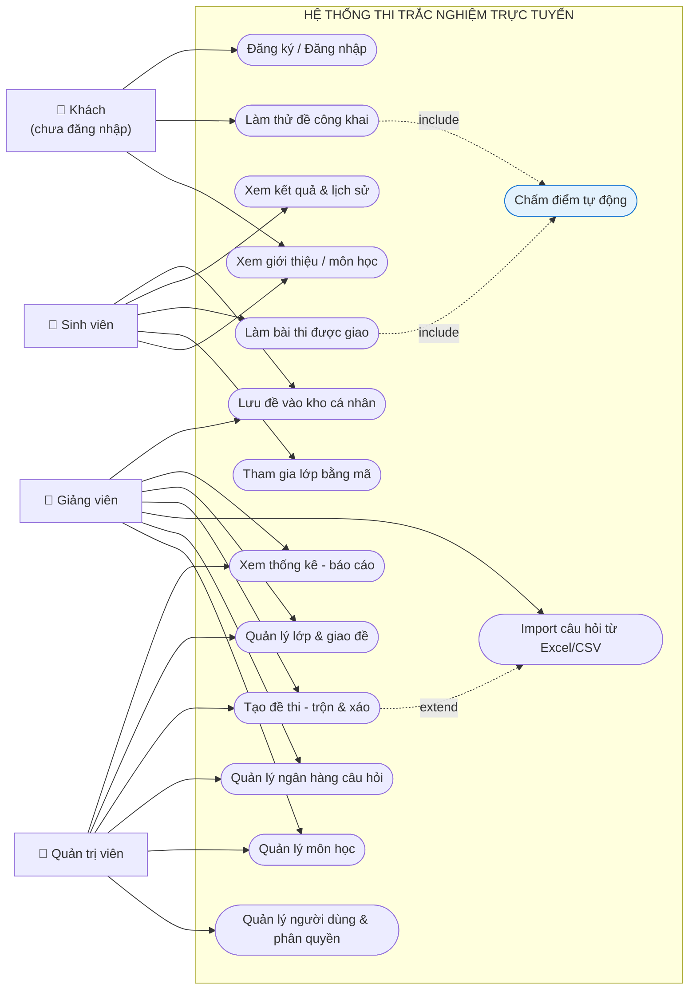

# Sơ đồ thiết kế — Hệ thống thi trắc nghiệm trực tuyến

> Giai đoạn 1: CHỈ trắc nghiệm (chưa có AI). DB: MySQL.
> Các bảng AI (`QUESTION_TEMP`, `AI_LOGS`) sẽ thêm ở giai đoạn 2.
>
> Cách chỉnh sửa: copy đoạn code mermaid dán vào https://mermaid.live để xem/sửa trực quan.

---

## 1. Sơ đồ phân rã chức năng (Sitemap)

```mermaid
flowchart TD
    ROOT[HỆ THỐNG THI TRẮC NGHIỆM TRỰC TUYẾN]

    ROOT --> A[1. Quản lý Hệ thống]
    ROOT --> B[2. Quản lý Ngân hàng Câu hỏi]
    ROOT --> C[3. Quản lý Đề thi]
    ROOT --> D[4. Tổ chức Thi trực tuyến]
    ROOT --> E[5. Thống kê - Báo cáo]
    ROOT --> F[6. Tìm kiếm]

    A --> A1[Đăng nhập & phân quyền User]
    A --> A2[Quản lý người dùng - Admin tạo GV/SV]
    A --> A3[Quản lý hồ sơ cá nhân]

    A --> A4[Quản lý lớp/nhóm & gán sinh viên]

    B --> B1[Quản lý môn học]
    B --> B2[Quản lý câu hỏi & đáp án]
    B --> B3[Import câu hỏi - Excel/CSV]

    C --> C1[Thêm/Xóa/Sửa đề thi]
    C --> C2[Chọn câu hỏi vào đề]
    C --> C3[Cài đặt cấu hình: thời gian, điểm đậu, đảo câu...]
    C --> C4[Giao đề cho lớp - private / public]

    D --> D1[SV: Xem danh sách đề được giao]
    D --> D2[SV: Vào làm bài thi]
    D --> D3[SV: Nộp bài]
    D --> D4[Chấm điểm tự động]
    D --> D5[SV: Xem kết quả & lịch sử thi]
    D --> D6[Khách: làm thử - giới hạn 20 câu, có quảng cáo]

    E --> E1[Thống kê điểm theo đề/môn]
    E --> E2[Thống kê tỉ lệ đậu/rớt]
```

---

## 2. Sơ đồ thực thể quan hệ (ERD) — MySQL

---

## 3. Những thay đổi so với bản cũ của bạn

- **Bỏ tạm** 2 bảng `QUESTION_TEMP` và `AI_LOGS` (dành cho giai đoạn AI).
- `USERS`: thêm `email`, `full_name`, `status`, `created_at`; đổi `password` → `password_hash` (bảo mật).
- `QUESTION_MAIN`: thêm `question_type` (quyết định cách chấm), `created_by`, `created_at`; bỏ `approved_at/approved_by` (chỉ cần khi có quy trình duyệt AI).
- `ANSWERS`: thêm `label` (A/B/C/D) và `order_index`.
- `EXAMS`: thêm `created_by`, `description`, `shuffle`, `status`.
- `EXAM_QUESTIONS`: thêm `points` (điểm mỗi câu).
- `SUBMISSIONS`: thêm `status`, `is_passed`.
- `SUBMISSION_DETAILS`: thêm khóa chính `id` và **FK rõ ràng** `selected_answer_id → ANSWERS`.
- Bổ sung luồng **Sinh viên** trong sitemap (xem đề → làm bài → nộp → xem kết quả).

## 3b. Sơ đồ Use Case (biểu diễn bằng Mermaid)

> Mermaid không có ký hiệu use case chuẩn UML, nên dùng flowchart mô phỏng:
> hình tròn dẹt = use case, chữ đậm = tác nhân (actor). Có thể vẽ lại trong draw.io theo đúng ký hiệu UML dựa trên nội dung này.

## 4. Cập nhật (theo yêu cầu mới)

- Câu hỏi **chỉ 1 đáp án đúng**: `question_type` còn `single` / `truefalse`.
- Thêm 3 bảng cho lớp/nhóm: **`CLASSES`** (lớp), **`CLASS_STUDENTS`** (sinh viên trong lớp, quan hệ nhiều-nhiều), **`EXAM_CLASSES`** (giao đề cho lớp, nhiều-nhiều).
- `EXAMS.access_type`: `private` = chỉ lớp được giao mới làm; `public` = ai cũng làm được.
- Hỗ trợ **khách (không đăng nhập)**: `SUBMISSIONS.user_id` cho phép NULL + thêm `guest_name`.
- **Lưu ý:** giới hạn "khách chỉ làm 20 câu" và "hiện quảng cáo" là **logic ở code** (kiểm tra khi gọi API), không cần cột trong DB.

