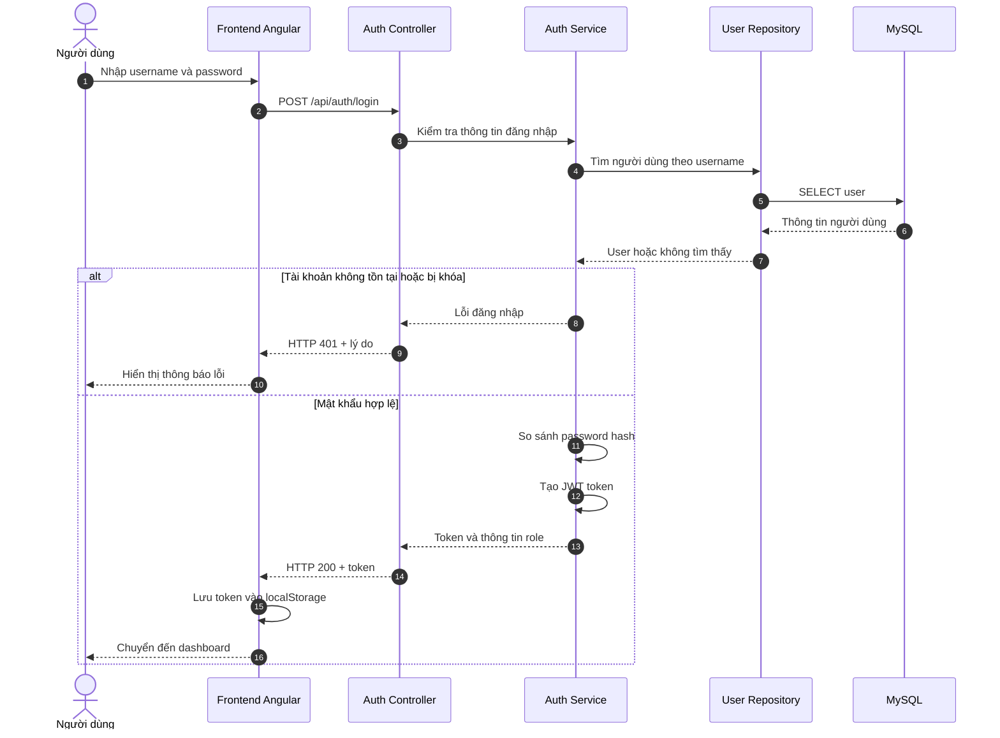
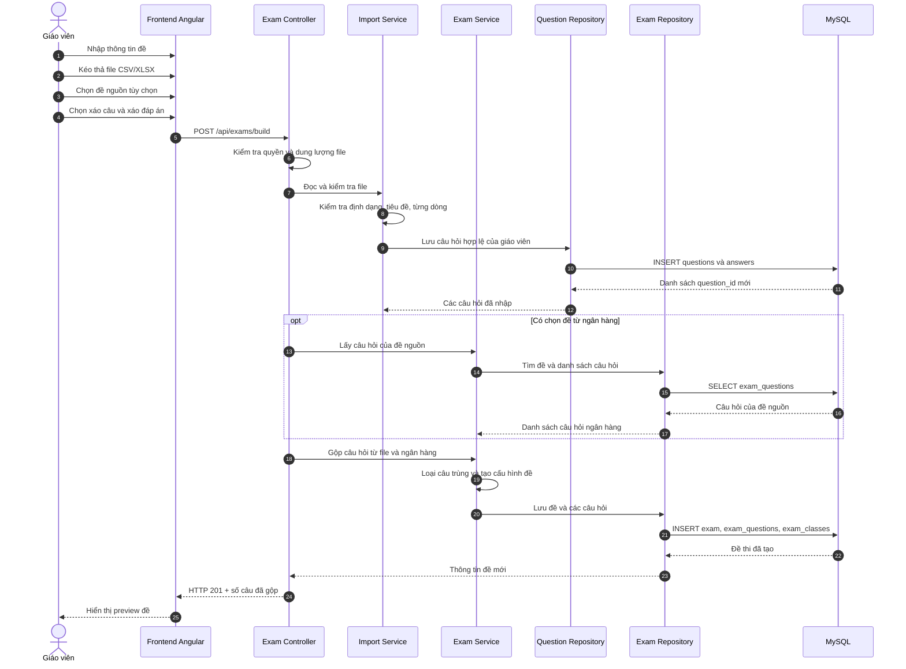
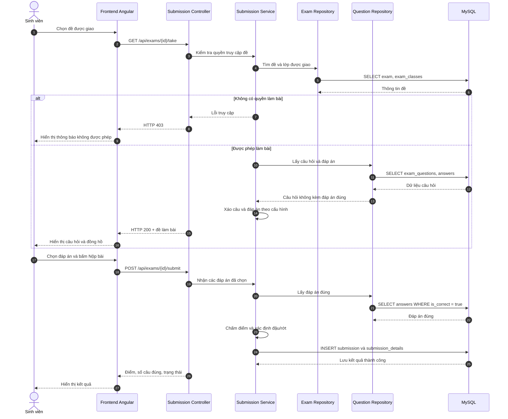
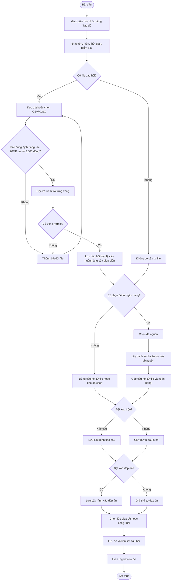
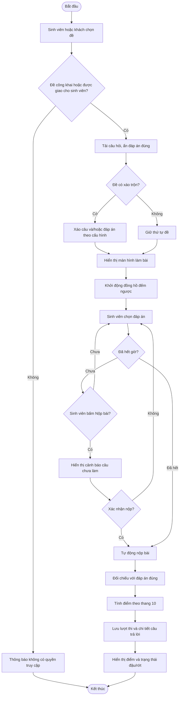
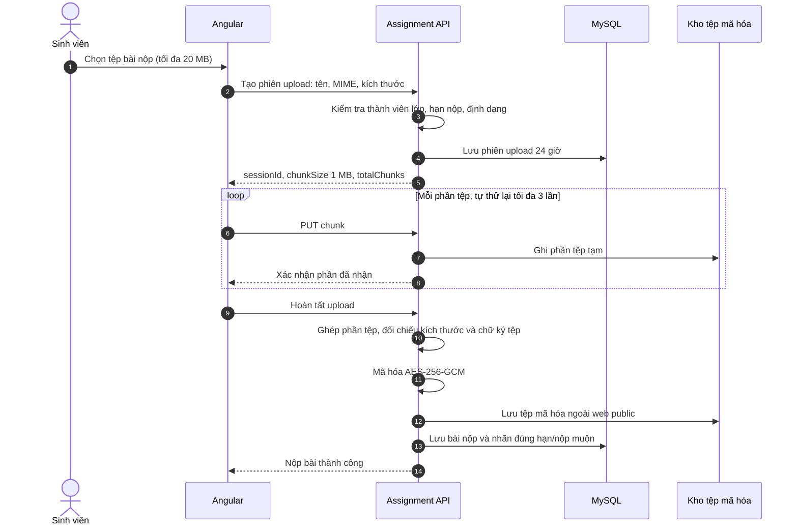
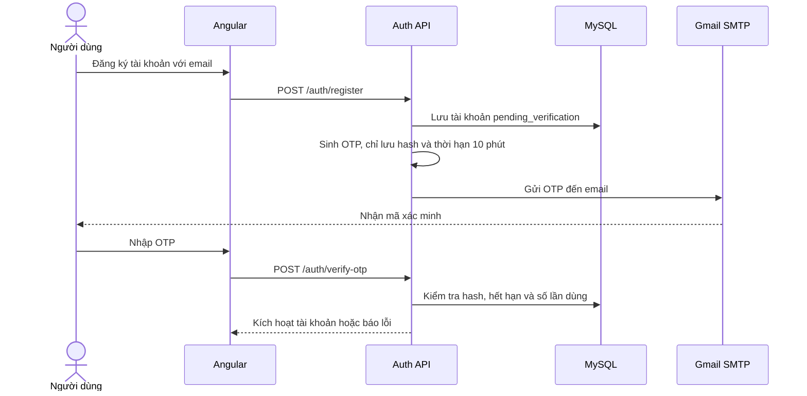
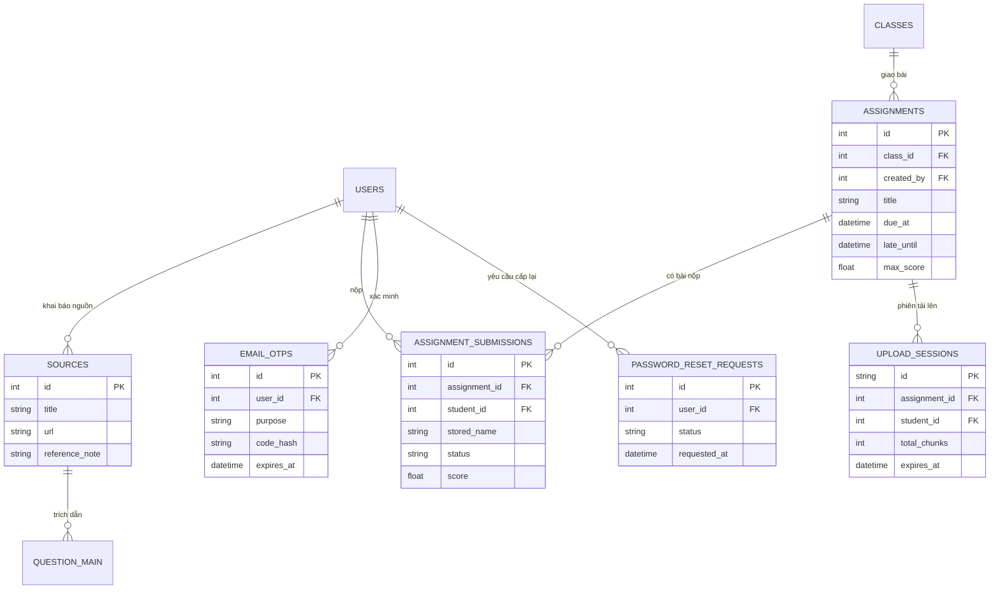
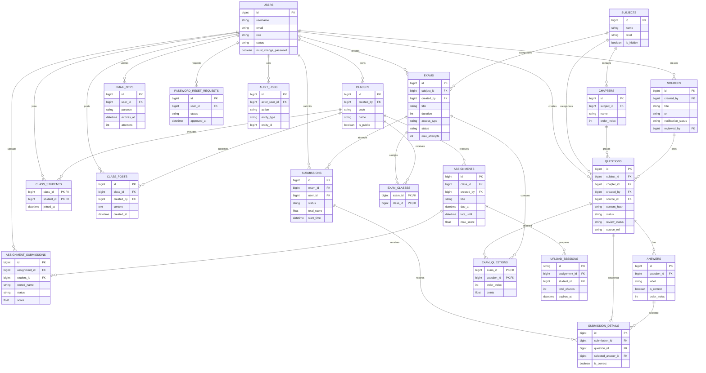
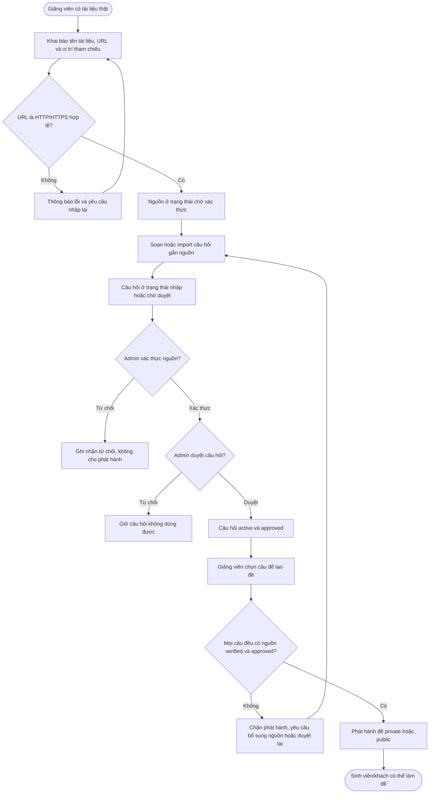

# Sơ đồ UML – Website quản lý ngân hàng đề thi đại học

Tài liệu này mô tả phạm vi triển khai của đề tài **“Xây dựng website quản lý ngân hàng đề thi”**, tập trung cho học phần bậc đại học. Hệ thống hỗ trợ quản lý nguồn câu hỏi, tạo/in đề, tổ chức lớp học và bài tập; AI là hướng mở rộng, không nằm trong phạm vi hiện tại. Có thể dán từng khối Mermaid vào [Mermaid Live](https://mermaid.live) để chỉnh sửa và xuất PNG/SVG.

## 1. Sơ đồ tuần tự – Đăng nhập

## 2. Sơ đồ tuần tự – Giáo viên tạo đề từ file và ngân hàng đề

## 3. Sơ đồ tuần tự – Sinh viên làm và nộp bài

## 4. Sơ đồ hoạt động – Tạo đề thi

## 5. Sơ đồ hoạt động – Làm bài và chấm điểm

## 6. Sơ đồ tuần tự – Nộp bài tập có kiểm tra tệp và mã hóa

## 7. Sơ đồ tuần tự – Kích hoạt tài khoản bằng OTP

## 8. Các bảng bổ sung cần thể hiện trong ERD bản nộp luận văn

## 9. Gợi ý đưa vào luận văn

- Dùng **Sơ đồ tuần tự 1** cho chức năng đăng nhập và phân quyền.
- Dùng **Sơ đồ tuần tự 2** cho chức năng tạo đề từ file và ngân hàng câu hỏi; đây là điểm nổi bật của đề tài.
- Dùng **Sơ đồ tuần tự 3** cho chức năng tổ chức thi và chấm điểm.
- Dùng **Sơ đồ hoạt động 1** cho quy trình giáo viên tạo đề.
- Dùng **Sơ đồ hoạt động 2** cho quy trình sinh viên làm bài.
- Khi xuất hình, nên dùng khổ ngang, font 12–14px, tiêu đề hình theo dạng: `Hình 3.x. Sơ đồ tuần tự chức năng ...`.
- Cập nhật tên các hình từ “Hệ thống thi trắc nghiệm” thành “Website quản lý ngân hàng đề thi đại học” để thống nhất với tên đề tài đã chốt.

## 10. ERD bám sát database triển khai

> Dùng sơ đồ này thay cho ERD khái niệm khi viết phần thiết kế cơ sở dữ liệu. Tên thực thể trùng với bảng MySQL đang chạy; có thể dán trực tiếp vào Mermaid Live để sửa và xuất hình.

## 11. Hoạt động: kiểm chứng nguồn trước khi phát hành đề

